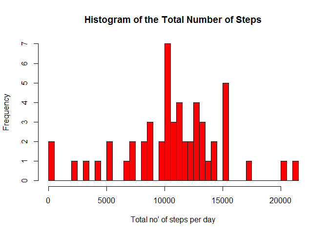
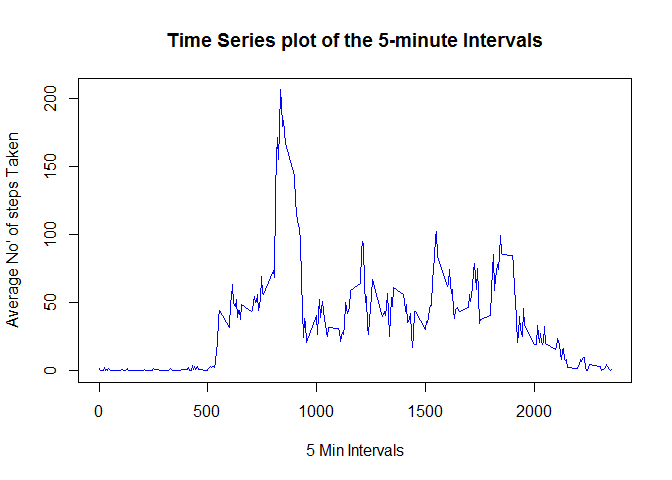
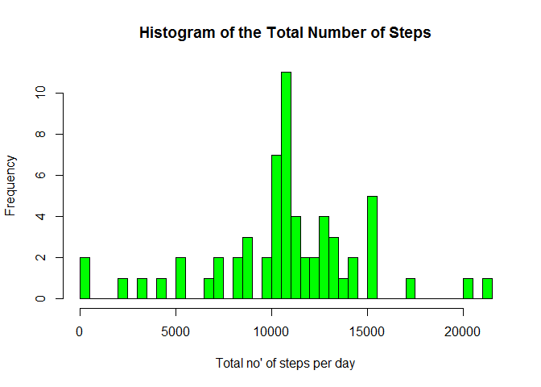

# Reproducible Research: Peer Assessment 1


## Loading and preprocessing the data


```r
unzip("activity.zip")
activity <- read.csv("activity.csv")
summary(activity)
```

```
##      steps                date          interval     
##  Min.   :  0.00   2012-10-01:  288   Min.   :   0.0  
##  1st Qu.:  0.00   2012-10-02:  288   1st Qu.: 588.8  
##  Median :  0.00   2012-10-03:  288   Median :1177.5  
##  Mean   : 37.38   2012-10-04:  288   Mean   :1177.5  
##  3rd Qu.: 12.00   2012-10-05:  288   3rd Qu.:1766.2  
##  Max.   :806.00   2012-10-06:  288   Max.   :2355.0  
##  NA's   :2304     (Other)   :15840
```


## What is mean total number of steps taken per day?

i). First we sum the number of steps taken each day.


```r
steps.date <- aggregate(steps~date, data=activity, FUN=sum)
colnames(steps.date)<-c("date","steps")
head(steps.date)
```

```
##         date steps
## 1 2012-10-02   126
## 2 2012-10-03 11352
## 3 2012-10-04 12116
## 4 2012-10-05 13294
## 5 2012-10-06 15420
## 6 2012-10-07 11015
```

ii). Then take the **mean** and **median** values.


```r
mean(steps.date$steps)
```

```
## [1] 10766.19
```

```r
median(steps.date$steps)
```

```
## [1] 10765
```


ii). We then plot a histogram of the total number of steps taken each day.


```r
hist(steps.date$steps, breaks=50, xlab="Total no' of steps per day", ylab="Frequency" , main="Histogram of the Total Number of Steps" , col="red")
```

 


## What is the average daily activity pattern?
i). Make a time series plot (i.e. `type = "l"`) of the 5-minute nterval (x-axis) and the average number
 of steps taken, averaged across all days (y-axis)


```r
steps.interval <- aggregate(steps ~ interval, data=activity, FUN=mean)
plot(steps.interval, type="l", xlab= "5 Min Intervals", ylab= "Average No' of steps Taken", main="Time Series plot of the 5-minute Intervals", col="blue")
```

 

ii). Which 5-minute interval, on average across all the days in the dataset, contains the maximum number of steps?


```r
steps.interval$interval[which.max(steps.interval$steps)]
```

```
## [1] 835
```

## Imputing missing values

i). Calculate and report the total number of missing values in the dataset (i.e. the total number of rows with `NA`s)


```r
sum(is.na(activity))
```

```
## [1] 2304
```

ii). Devise a strategy for filling in all of the missing values in the dataset.
The strategy does not need to be sophisticated. 
For example, you could use the mean/median for that day, or the mean for that 5-minute interval, etc.

**As suggested, we will use the mean for the 5-minute interval to fill in these missing values.**

iii). Create a new dataset that is equal to the original dataset but with the missing data filled in.


```r
#As suggested, we will use the mean for the 5-minute interval to fill in these missing values.
activity <- merge(activity, steps.interval, by="interval", suffixes=c("",".y"))
nas <- is.na(activity$steps)
activity$steps[nas] <- activity$steps.y[nas]
activity <- activity[,c(1:3)]
#activity
```

iv). Make a histogram of the total number of steps taken each day and Calculate and report the mean and median total number of steps taken per day. Do these values differ from the estimates from the first part of the assignment? 
   What is the impact of imputing missing data on the estimates of the total daily number of steps?


```r
steps.date <- aggregate(steps ~ date, data=activity, FUN=sum)
hist(steps.date$steps, breaks=50, xlab="Total no' of steps per day", ylab="Frequency" , main="Histogram of the Total Number of Steps" , col="green")
```

 

```r
mean(steps.date$steps)
```

```
## [1] 10766.19
```

```r
median(steps.date$steps)
```

```
## [1] 10766.19
```

**The Mean total of steps remains the same as the first part of the assignment (a value of 10766.19).
The median value however has changed from a value of 10765 to 10766.19
There appears to be only slight impact on the median by inputting the missing data, increasing it slightly to the same value as the mean.**

## Are there differences in activity patterns between weekdays and weekends?

thoughts

